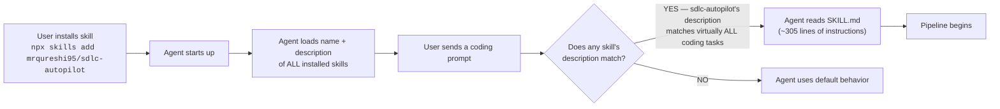
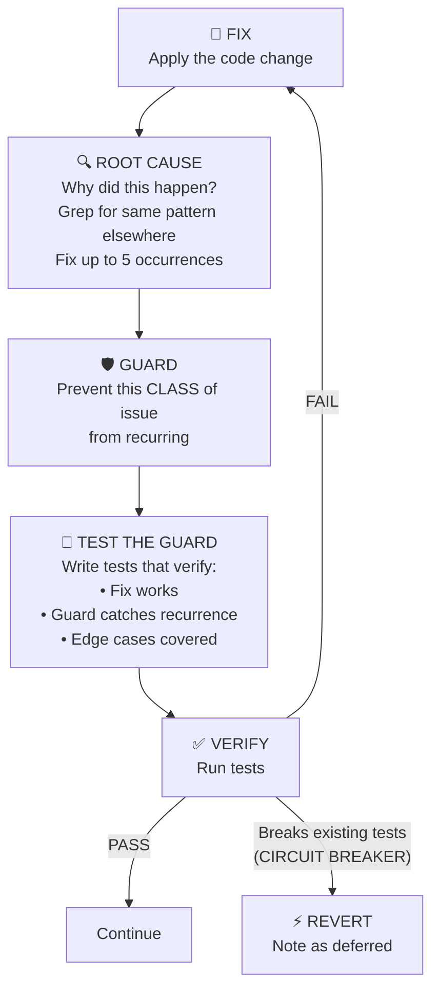
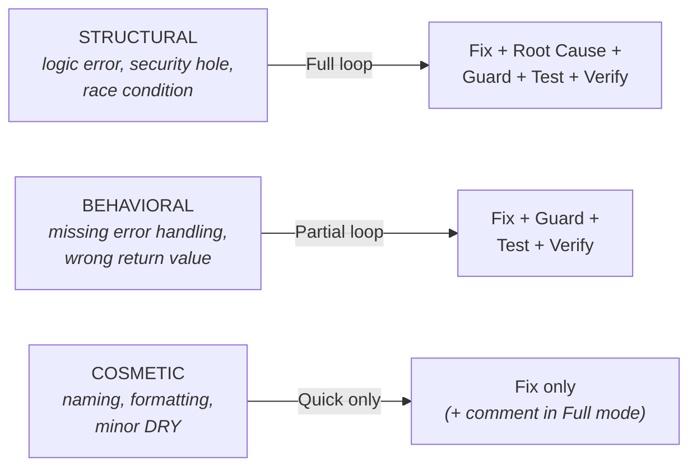
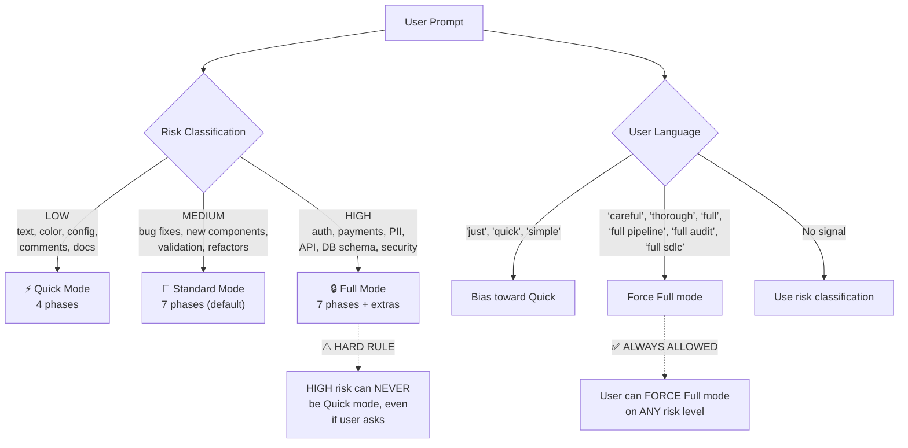
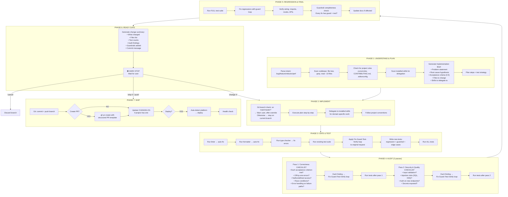
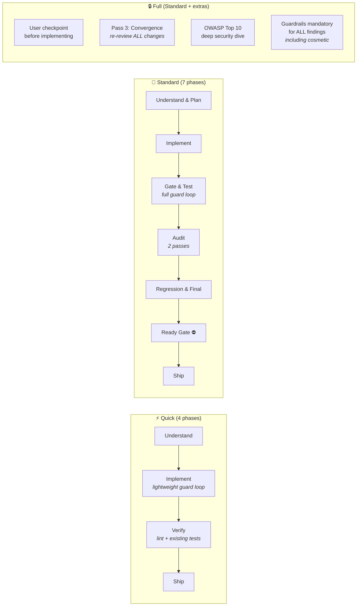
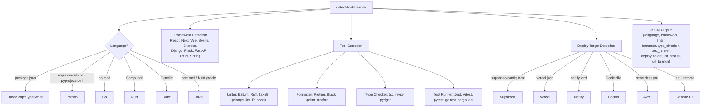
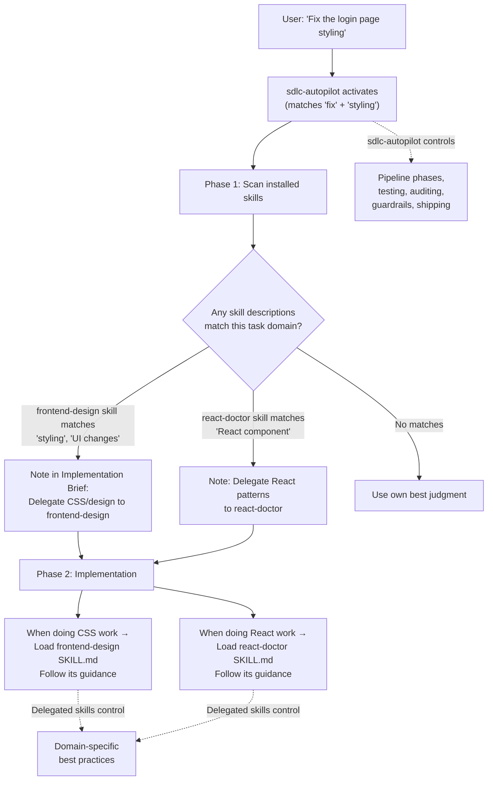
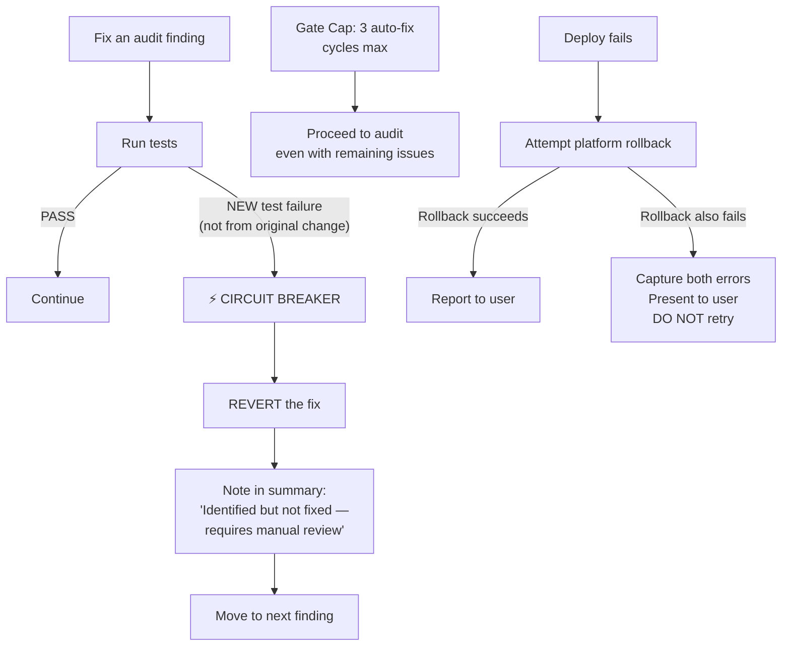
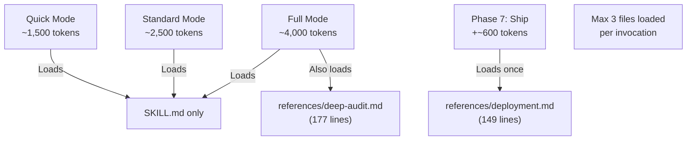

# SDLC Autopilot — Guidance Document

## What Is It?

sdlc-autopilot is an **Agent Skill** — a set of instructions that AI coding agents (GitHub Copilot, Cursor, Claude Code, Windsurf, etc.) load to change how they handle coding tasks. Instead of the agent just making a code change and stopping, this skill forces it through a full software development lifecycle: understand → plan → implement → test → audit → guard → ship.

The user types one messy sentence like *"the search page crashes when you press enter"* — and the agent delivers a tested, audited, guarded fix with a conventional commit, ready to deploy.

---

## How It Gets Activated



The key is the **description** field in the YAML frontmatter. It's written to match every possible coding task: *"bug fixes, features, refactors, improvements, performance, security fixes, API changes, UI changes, database changes..."* — so any coding prompt triggers it.

The agent only loads the full SKILL.md when triggered. This is called **progressive disclosure** — name+description are always in context (~574 chars), but the full ~305-line instruction set is loaded on-demand.

---

## The Core Innovation: Fix-Guard-Test-Verify Loop

This is what separates this skill from a basic "make the change" workflow. Every issue — the original request AND anything found during audit — goes through this loop:



### Guardrail Priority

Use the FIRST viable option (lightest effective):

1. **Type/compiler enforcement** — caught at build time
2. **Linter/static analysis rule** — caught before tests
3. **Runtime assertion/invariant** — caught at test/runtime
4. **Targeted test** — caught during test suite
5. **Code comment at danger point** — caught during review

### Proportionality — Effort Scales With Severity



**Security findings ALWAYS get the full loop — no exceptions.**

---

## Mode Selection

The skill picks one of 3 modes based on risk + user language:



### Risk Classification Table

| Risk Level | Examples | Mode |
|---|---|---|
| **LOW** | Text/copy, color/style, config values, comments, simple renames, docs-only | Quick |
| **MEDIUM** | Bug fixes, new UI components, new functions, form fields, validation, behavior-preserving refactors | Standard |
| **HIGH** | Auth/authz, payments, PII/data handling, API changes, DB schema, shared libraries, security fixes, deployment config, env vars, multi-service | Full |

---

## The Full Pipeline (Standard Mode — 7 Phases)



---

## Quick Mode vs Standard vs Full



### Full Mode Additions

| Addition | Description |
|---|---|
| **User checkpoint** | Phase 1 presents the plan and waits for explicit approval before implementing |
| **Pass 3: Convergence** | Re-reviews ALL changes from passes 1-2; loads `references/deep-audit.md` for OWASP Top 10 checklist |
| **Security Deep Dive** | Full OWASP Top 10 review, auth flow verification, data handling audit |
| **Mandatory guardrails** | ALL findings get guardrails, including cosmetic ones |
| **Expanded root cause scan** | Wider search radius for pattern occurrences |

---

## Toolchain Auto-Detection

Before running gates, the skill uses `scripts/detect-toolchain.sh` to auto-detect the project's stack:



The gate runner (`scripts/run-gates.sh`) then uses this info to run the right tools with auto-fix.

### Supported Detection Matrix

| Category | Detected Tools |
|---|---|
| **Languages** | JavaScript, TypeScript, Python, Go, Rust, Ruby, Java |
| **Frameworks** | Next.js, React, Vue, Svelte, Express, Fastify, Django, Flask, FastAPI, Rails, Spring |
| **Linters** | ESLint, Ruff, flake8, golangci-lint, Rubocop |
| **Formatters** | Prettier, Black, gofmt, rustfmt |
| **Type Checkers** | tsc, mypy, pyright |
| **Test Runners** | Jest, Vitest, pytest, go test, cargo test, npm test |
| **Deploy Targets** | Supabase, Vercel, Netlify, AWS (Serverless/SAM), Docker, Generic Git |

---

## Dynamic Skill Delegation

sdlc-autopilot is an **orchestrator** — it controls the pipeline, but delegates domain expertise to other installed skills:



### Delegation Rules

- **Always** check the installed skills list — never assume what the user has
- If **none** are relevant → proceed with the agent's own best judgment
- If **multiple** are relevant → use each for its respective domain
- sdlc-autopilot remains in control of the **overall pipeline** (phases, testing, auditing)
- Delegated skills handle **domain-specific best practices** only
- **Fallback:** If the installed skills list is not available in context (some agents don't expose it) → skip delegation entirely and proceed with own judgment. Do not error or stall.

---

## Circuit Breaker & Safety Mechanisms



### Safety Hard Rules

| Rule | Description |
|---|---|
| **Never auto-deploy to production** | Preview/staging deploys are acceptable; production requires explicit user approval |
| **Warn before committing to main/master** | If on main/master, warn and offer to create a branch; user can say "commit to main" to override |
| **Never expose secrets** | Reference by variable name only (`$VAR_NAME`), never include values |
| **Circuit breaker on fix spirals** | If fixing a finding causes a NEW test failure → revert immediately |
| **Gate cap** | Maximum 3 auto-fix cycles, then proceed |
| **Hard stop at Ready Gate** | Phase 6 always waits for user confirmation |
| **No retry on deploy failure** | Attempt rollback once, then present errors to user |

---

## Token Budget Strategy



Reference files are loaded **only when needed** — `deep-audit.md` only in Full mode Phase 4, `deployment.md` only in Phase 7. Token budgets are **skill instruction overhead only** — total pipeline cost depends on codebase size and files read.

---

## Graceful Degradation

The pipeline never fully breaks — it degrades gracefully:

| Missing | Behavior |
|---|---|
| **No shell commands** | Write tests + list commands for user. All phases still happen. |
| **No test framework** | Write tests in logical format. Suggest framework, don't block. Guardrail tests still written. |
| **No linter/formatter/typechecker** | Skip automated gates. Suggest setup, don't insist. |
| **No git** | Skip branching/commits/push. All other phases still happen. |
| **Context pressure (many/large files)** | If files exceed ~30% of context, summarize rather than load in full. Prioritize files from user's prompt. Don't load reference files unless full mode. |

---

## File Architecture

```
sdlc-autopilot/
├── SKILL.md                      ← Main pipeline (~305 lines, loaded on activation)
├── GUIDANCE.md                   ← This document
├── references/
│   ├── deep-audit.md             ← OWASP + guardrail patterns (Full mode only)
│   └── deployment.md             ← 6 platform deploy guides (Phase 7 only)
├── scripts/
│   ├── detect-toolchain.sh       ← Auto-detect language/framework/tools → JSON
│   └── run-gates.sh              ← Run linter/formatter/typechecker/tests
├── evals/
│   ├── evals.json                ← 10 test scenarios for validation
│   └── fixtures/01-10/           ← Realistic codebases with planted bugs
├── examples/                     ← Walkthroughs showing each mode
├── README.md / CONTRIBUTING.md / LICENSE.txt / CHANGELOG.md
```

The entire skill is **3 files at runtime** max: `SKILL.md` (always), `deep-audit.md` (full mode), `deployment.md` (deploy phase).

---

## Evals (Validation Test Suite)

The skill ships with 10 evaluation scenarios covering the full spectrum:

| # | Scenario | Mode | What It Tests |
|---|---|---|---|
| 01 | Cosmetic button styling | Quick | Low-risk change, minimal pipeline |
| 02 | Bug fix — search page crash | Standard | Root cause analysis, guard loop, regression tests |
| 03 | Feature — dark mode toggle | Standard | New feature, state management, test writing |
| 04 | Refactor — auth service extraction | Standard | Behavior-preserving refactor, contract tests |
| 05 | Security — SQL injection | Full | OWASP audit, parameterized queries, full guard loop |
| 06 | Audit finding — race condition | Standard | Concurrent data fetching, idempotency guard |
| 07 | No tooling project | Standard | Graceful degradation, manual test format |
| 08 | User override — force quick on high risk | Standard | Hard rule enforcement (rejects Quick for HIGH risk) |
| 09 | Circuit breaker trigger | Standard | Fix-break spiral detection, revert behavior |
| 10 | Null pattern — defensive coding | Standard | Null checks, type narrowing, guard pattern |

---

## Announcements

Each phase ends with a one-line, 15-word-max announcement:

```
"Bug fix identified. Implementing 3 steps."
"Implementation complete. Running checks."
"4 tests pass (2 new, 1 guardrail). Linting clean."
"Audit done. 2 issues: fixed 2, guarded 2, tested 2."
"All 6 tests pass. 2 guardrails verified."
"Ready gate passed. Summary above."
"Pushed to fix/search-keyboard. Commit: a1b2c3d."
```

---

## Critical Behaviors Summary

| Behavior | Rule |
|---|---|
| **Follow-ups** | Pipeline shipped → start NEW pipeline. During ready gate → "change X" returns to Phase 2. |
| **Mid-pipeline abort** | User says "stop"/"undo everything" → discard all changes (`git checkout -- .`), offer to delete created branch. |
| **Monorepos** | Auto-detect (`packages/`, `apps/`, `pnpm-workspace.yaml`, `lerna.json`). Scope tests and root cause scans to affected packages. |
| **Large codebases** | Cap ~10 files in Phase 1. Root cause scans use grep only — never scan entire codebase file-by-file. |
| **Project rules conflict** | SDLC provides the PROCESS. Project rules provide the STANDARDS. Style conflicts → project rules win. Process conflicts → SDLC wins. |
| **Can't find the bug** | Report what was searched. Ask ONE specific question. Never guess. |
| **Secrets** | Never in output or commits. Never add .env to git. Reference by variable name only. |
| **Stateless** | Each invocation is independent. No memory between pipeline runs. |
